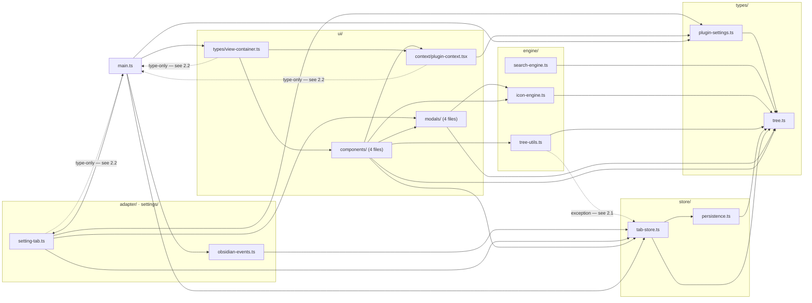
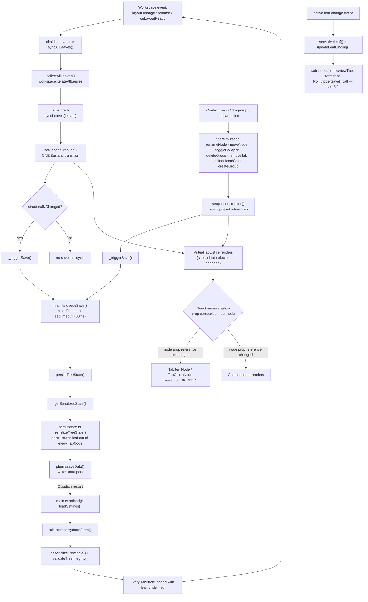

# TabEngine — Architectural & Technical Review

| | |
|---|---|
| **Document version** | 1.0 |
| **Plugin version reviewed** | 1.0.0 (`manifest.json`) |
| **Date** | 2026-09-17 |
| **Scope** | All 20 TypeScript/TSX source files under `src/`, plus `manifest.json`, `package.json`, `tsconfig.json`, `esbuild.config.mjs`, `styles.css` |
| **Status** | Reflects the implementation as built and code-audited in this repository. Claims in §5 are labeled as either *derived* (from source inspection), *estimated* (reasoned from complexity class), or *unverified* (would require runtime profiling) — see §5.0. |

---

## 1. Executive Architectural Summary

TabEngine's design rests on three structural pillars, each of which is a direct, load-bearing consequence of the "Manual-First & Decoupled Architecture" philosophy — not a stylistic preference layered on top of it.

**1. Flat-Map state dictionary.** The tree is not a nested object graph (`{ children: Node[] }`) but a single-level `Record<string, CustomTreeNode>` (`nodes`) plus an ordering array (`rootIds: string[]`). Parent→child order lives in `GroupNode.childrenIds`; child→parent lives in `BaseNode.parentId`. Every node — regardless of nesting depth — is one hash-table lookup away from any other. This is what makes "infinite manual nesting" tractable: nesting depth affects *rendering* (§3) but never affects *lookup* cost.

**2. Decoupled volatility vs. persistence.** `WorkspaceLeaf` — Obsidian's live, non-serializable pane handle — never crosses the boundary into `data.json`. The type system enforces this (`SerializedTreeState` is typed over `Omit<TabNode, "leaf">`) and the runtime enforces it a second time (`serializeTreeState()` destructures `leaf` out of every `TabNode` before it touches `JSON.stringify`). Structural facts (titles, groupings, icons, colors, collapse state) are durable; the live pane binding is rebuilt every session by `syncLeaves()` matching on `leafId`. Neither side ever has to pretend to be the other.

**3. Zero DOM bloat.** A collapsed group's children are not hidden with CSS — they are not rendered at all (`{!node.isCollapsed && (...)}` in `TabGroupNode.tsx`). A search-filtered-out branch is not dimmed — it returns `null` from the DFS walk (`VirtualTabList.tsx`). Icons are not shipped as a bundled SVG/font asset — they're rendered through Obsidian's own `setIcon()`, so the plugin adds zero icon-payload weight to `main.js`. "Zero bloat" here is a literal, verifiable claim about DOM node count and bundle size, not a marketing phrase.

**Honest naming caveat:** `VirtualTabList.tsx` is named after the *file* the original specification assigned this responsibility to ("Recursive tree renderer with search filter"), not after list-virtualization (à la `react-window`). There is no viewport-based recycling — every visible node gets a real DOM node. For this domain (a personal tab list, realistically tens to low hundreds of items), that's the right trade-off (§5), but a reader should not infer windowed virtualization from the name.

---

## 2. Layer & File Matrix

The codebase is organized into 6 layers plus a root entry point, forming (almost) a strict dependency DAG:

### 2.1 Layering exception: `engine/tree-utils.ts → store/tab-store.ts`

`getSiblingIds()` imports `EMPTY_ARRAY` from `tab-store.ts` for its empty-result fallbacks. Strictly, `engine/` is meant to sit *below* `store/` (pure functions the store and UI both consume). This one import inverts that for a single named constant. It is safe (no cycle — `tab-store.ts` does not import from `tree-utils.ts`) and it is deliberate (reusing the one canonical empty-array reference rather than declaring a second one), but it is a real, acknowledged exception to the layering diagram above, not an oversight being glossed over.

### 2.2 Type-only back-references (not runtime cycles)

Three files import `TabEnginePlugin` from `../main` (or `../../main`) using `import type`: `settings/setting-tab.ts`, `ui/context/plugin-context.tsx`, and `ui/types/view-container.ts`. Since `main.ts` also imports (at the value level) `setting-tab.ts` and `view-container.ts`, this is a textual import cycle. It is not a *runtime* cycle: `import type` is erased entirely at compile time (enforced by `"isolatedModules": true` in `tsconfig.json`, which requires the compiler to be able to strip type-only imports without full-program analysis), so no circular `require()`/`import` resolution ever happens in the bundled `main.js`. This is the standard, safe way to give a class access to its own plugin instance's type without either (a) duplicating the `TabEnginePlugin` interface shape in every consumer, or (b) typing it as `any` and losing all checking.

### 2.3 File matrix

#### `types/` — 2 files, zero runtime logic

| File | Responsibility | Key Exports | Depends On |
|---|---|---|---|
| `tree.ts` | Discriminated-union node shapes; the serialization contract | `TabNode`, `GroupNode`, `CustomTreeNode`, `SerializedTreeState`, `isTabNode()`, `isGroupNode()` | `obsidian` (type-only: `WorkspaceLeaf`) |
| `plugin-settings.ts` | Display-setting shape and defaults | `PluginSettings`, `DEFAULT_SETTINGS` | `./tree` |

#### `engine/` — 3 files, pure functions only

| File | Responsibility | Key Exports | Depends On |
|---|---|---|---|
| `search-engine.ts` | DFS substring match over the tree; keeps ancestors of a match visible | `filterTree()`, `isNodeVisible()` | `../types/tree` |
| `icon-engine.ts` | View-type → Lucide name resolution; wraps Obsidian's `setIcon()` | `resolveNodeIcon()`, `applyIcon()`, `ICON_PICKER_OPTIONS` | `obsidian`, `../types/tree` |
| `tree-utils.ts` | Sibling-list lookup for drag-to-reorder | `getSiblingIds()` | `../types/tree`, `../store/tab-store` (§2.1) |

#### `store/` — 2 files, the single source of truth

| File | Responsibility | Key Exports | Depends On |
|---|---|---|---|
| `persistence.ts` | ID generation; serialize/deserialize/validate the tree | `generateId()`, `serializeTreeState()`, `deserializeTreeState()`, `validateTreeIntegrity()` | `../types/tree` |
| `tab-store.ts` | The Zustand store: state, all 8 structural mutations, lifecycle (`hydrateStore`, `syncLeaves`), runtime setters, `EMPTY_ARRAY` | `useTabStore`, `EMPTY_ARRAY`, `EMPTY_NODES`, `selectChildrenIds()`, `selectRootIds()` | `zustand`, `obsidian` (type-only), `../types/tree`, `./persistence` |

#### `adapter/` — 1 file, the only Obsidian-workspace listener

| File | Responsibility | Key Exports | Depends On |
|---|---|---|---|
| `obsidian-events.ts` | Wires `layout-change` / `active-leaf-change` / `rename` / `onLayoutReady` to the store | `syncAllLeaves()`, `registerWorkspaceEvents()` | `obsidian`, `../store/tab-store` |

#### `settings/` — 1 file

| File | Responsibility | Key Exports | Depends On |
|---|---|---|---|
| `setting-tab.ts` | All 5 `PluginSettings` fields + guarded "Reset layout" | `TabEngineSettingTab` | `obsidian`, `../main` (type-only), `../ui/modals/icon-picker-modal`, `../types/plugin-settings`, `../store/tab-store` |

#### `ui/context/` — 1 file, the React↔plugin bridge

| File | Responsibility | Key Exports | Depends On |
|---|---|---|---|
| `plugin-context.tsx` | Exposes the plugin instance; mirrors `plugin.settings` into React state via `Events` | `PluginContextProvider`, `usePlugin()`, `useSettings()` | `react`, `../../main` (type-only), `../../types/plugin-settings` |

#### `ui/modals/` — 4 files, imperative Obsidian `Modal`/`FuzzySuggestModal` (no JSX — see ADR-004)

| File | Responsibility | Key Exports | Depends On |
|---|---|---|---|
| `rename-modal.ts` | Text-input prompt (tabs, groups, new-group) | `RenameModal` | `obsidian` |
| `icon-picker-modal.ts` | Fuzzy Lucide-name picker | `IconPickerModal` | `obsidian`, `../../engine/icon-engine` |
| `color-picker-modal.ts` | Native color swatch + validated hex field | `ColorPickerModal` | `obsidian` |
| `group-picker-modal.ts` | Fuzzy group picker for "Move to Group" | `GroupPickerModal` | `obsidian`, `../../types/tree` |

#### `ui/components/` — 4 files, the React render tree

| File | Responsibility | Key Exports | Depends On |
|---|---|---|---|
| `ObsidianIcon.tsx` | Memoized icon renderer (`useEffect` → `applyIcon`) | `ObsidianIcon` | `react`, `../../engine/icon-engine` |
| `TabItemNode.tsx` | Leaf row: click-to-focus, context menu, DnD source + drop-to-reorder | `TabItemNode` | `react`, `obsidian` (`Menu`), `../../types/tree`, `../../store/tab-store`, `./ObsidianIcon`, `../../engine/icon-engine`, `../../engine/tree-utils`, `../context/plugin-context`, `../modals/rename-modal`, `../modals/group-picker-modal` |
| `TabGroupNode.tsx` | Group header: collapse toggle, context menu, DnD source/target + cycle-guard | `TabGroupNode` | `react`, `obsidian` (`Menu`), `../../types/tree`, `../../store/tab-store`, `./ObsidianIcon`, `../../engine/icon-engine`, `../context/plugin-context`, all 4 `../modals/*` |
| `VirtualTabList.tsx` | Root DFS renderer, search filter, toolbar, empty state | `VirtualTabList` | `react`, `../../store/tab-store`, `../../engine/search-engine`, `./TabGroupNode`, `./TabItemNode`, `./ObsidianIcon`, `../../types/tree`, `../context/plugin-context`, `../modals/rename-modal` |

#### `ui/types/` — 1 file, the Obsidian↔React seam

| File | Responsibility | Key Exports | Depends On |
|---|---|---|---|
| `view-container.ts` | `ItemView` subclass; mounts/unmounts the React root | `TabEngineView`, `TAB_ENGINE_VIEW_TYPE` | `obsidian`, `react`, `react-dom/client`, `../../main` (type-only), `../context/plugin-context`, `../components/VirtualTabList` |

#### Root

| File | Responsibility | Key Exports | Depends On |
|---|---|---|---|
| `main.ts` | Plugin lifecycle: settings load/save, debounce, wiring every other layer together | `TabEnginePlugin` (default) | `obsidian`, `./types/plugin-settings`, `./store/tab-store`, `./adapter/obsidian-events`, `./settings/setting-tab`, `./ui/types/view-container` |

---

## 3. Data Flow & Lifecycle Trace

Four distinct paths exist through the system. They are drawn separately below because they have different persistence behavior — conflating them would misstate when a disk write actually happens.

### 3.1 Numbered trace (structural mutation → disk → restart)

1. A structural Obsidian event fires (`layout-change`, `rename`, or the one-time `onLayoutReady`) and `registerWorkspaceEvents()`'s handler calls `syncAllLeaves(plugin)`.
2. `collectAllLeaves()` walks `workspace.iterateAllLeaves()` into a flat array — this includes sidebar leaves, not just the main editor area, per the Manual-First philosophy of surfacing everything and letting the user decide what to organize.
3. `tab-store.ts`'s `syncLeaves()` builds a transient `leafId → nodeId` reverse map, then for each live leaf either rebinds an existing `TabNode` (refreshing `title`/`viewType`, flagging `structurallyChanged` only if those *persisted* fields actually differ) or creates a new root `TabNode` via `generateId()`. A second pass removes `TabNode`s whose `leafId` is no longer among the open leaves. All of this collapses into exactly **one** `set({ nodes, rootIds })` call — not one per leaf — which matters because Zustand/React batch a single `set()` into a single re-render pass.
4. If `structurallyChanged` is true, `_triggerSave()` fires the callback registered in `main.ts`'s `onload()`.
5. Independently, any of the 8 structural mutation actions (triggered from a context-menu item, a drag-drop handler, or the toolbar) always call `_triggerSave()` unconditionally at the end (Rule 1).
6. `main.ts`'s `queueSave()` receives the trigger, clears any pending timer, and starts a fresh 400ms `setTimeout`. N mutations arriving within 400ms of each other collapse into exactly one disk write.
7. When the timer fires, `persistTreeState()` calls `getSerializedState()` → `serializeTreeState()`, which destructures `leaf` out of every `TabNode` (`const { leaf: _leaf, ...rest } = node;`) before the result ever reaches `JSON.stringify` inside Obsidian's own `saveData()`.
8. On the next Obsidian startup, `loadSettings()` reads `data.json` (deep-merged against `DEFAULT_SETTINGS` so a partial/older save never drops the whole tree), then `hydrateStore()` calls `deserializeTreeState()` (every `TabNode` reconstructed with `leaf: undefined`) followed by `validateTreeIntegrity()`, which `console.warn`s any dangling `parentId`/`childrenIds`/`rootIds` reference without throwing.
9. `onLayoutReady` fires once Obsidian has restored its own previous workspace layout, triggering the first `syncAllLeaves()` of the session, which rebinds live `WorkspaceLeaf`s to the hydrated `TabNode`s by matching `leafId`.

### 3.2 Honest nuance: the "no save" path (B in the diagram)

`active-leaf-change` calls `setActiveLeaf()` and `updateLeafBinding()`, and **neither triggers `_triggerSave()`** — this is intentional (persisting on every focus change would be save-spam), but it means a title change captured *only* via `updateLeafBinding` is reflected in the UI immediately but not on disk until the next event that *does* trigger a save (in practice, `layout-change` fires on almost every tab interaction anyway, so staleness windows are small — but they are not zero, and this document should not claim otherwise).

### 3.3 Honest dependency: cross-restart `leafId` stability

Step 9 depends on Obsidian's *own* workspace-layout persistence (`.obsidian/workspace.json`, separate from this plugin's `data.json`) preserving leaf IDs across a restart when "restore previous session" behavior runs. That is standard, long-standing Obsidian behavior and is what every leaf-tracking community plugin relies on — but it is a dependency on host behavior outside this codebase's control, not a guarantee this codebase can itself enforce. If Obsidian's session restore is disabled or a leaf's ID changes for any host-side reason, `syncLeaves()` degrades gracefully: the old `TabNode` becomes stale and is removed, and the leaf reappears as a new root tab (Phase 2/3 of `syncLeaves()`, §4) — data loss of *grouping* for that one tab, not a crash.

---

## 4. Enforced Architectural Invariants

Each invariant below is stated with **where** it is enforced, not just what it claims.

### Rule 1 — Data Persistence Guarantee
Every one of the 8 structural mutations in `tab-store.ts` (`createGroup`, `renameNode`, `moveNode`, `toggleCollapse`, `deleteGroup`, `removeTab`, `setNodeIcon`, `setNodeColor`) ends with `get()._triggerSave()`. This was verified by direct grep audit during implementation: **10** call sites (8 mutations + the internal `_triggerSave` definition + `syncLeaves`'s conditional call). The 3 runtime-only setters (`setActiveLeaf`, `setSearchQuery`, `updateLeafBinding`) deliberately do **not** call it — see §3.2.

### Rule 2 — Defensive Array Guarding
Every `.map()`/iteration over a selector-derived array is preceded by `Array.isArray()` — **18** occurrences project-wide, spanning `tab-store.ts`, `persistence.ts`, `search-engine.ts`, `tree-utils.ts`, `TabGroupNode.tsx`, and `VirtualTabList.tsx`. This guards against a corrupted or hand-edited `data.json` producing a non-array `childrenIds`/`rootIds`, which would otherwise throw inside a React render.

### Rule 3 — No Direct State Mutations
Verified via the exact code in §5.1: every store mutation produces new object/array references via spread (`{ ...nodes, [id]: {...} }`, `[...arr]`) rather than assigning into existing structures. **35** spread operations counted in `tab-store.ts` alone. The one place this rule is explicitly noted as *not* applying is `main.ts`'s direct mutation of `this.settings.X = value` — that is plain Obsidian plugin lifecycle state, not Zustand state, and mutating it directly before `saveData()` is the standard, documented Obsidian convention.

### Rule 4 — Stop Event Propagation
**12** `stopPropagation()` calls across `TabItemNode.tsx` and `TabGroupNode.tsx` — on click, context-menu, and all four drag-lifecycle handlers. The reason this matters structurally (not just stylistically): tabs render *inside* group `
`s in the real DOM. Without `stopPropagation()`, clicking a tab nested three groups deep would bubble through three ancestor `onClick` handlers, toggling all three collapse states in addition to activating the tab.

### Rule 5 — Strict Discriminants
**13** strict `node.type === "tab" | "group"` checks project-wide; **zero** real matches for loose-property patterns (`node.isGroup`, `.hasOwnProperty(...)`) — the only 2 textual hits for that pattern are documentation strings inside `tree.ts`'s `isTabNode()`/`isGroupNode()` JSDoc, explicitly describing the anti-pattern the guards exist to prevent, not code that exhibits it (verified by direct inspection, §4 audit trail).

### Reference Stability (`EMPTY_ARRAY`)
`export const EMPTY_ARRAY: readonly string[] = Object.freeze([]);` in `tab-store.ts` is the **only** empty-array fallback value used anywhere a Zustand selector or `useMemo` dependency could be affected — **19** usages project-wide (extended, beyond the original selector-only scope, into `tree-utils.ts` and `TabGroupNode.tsx`'s `childrenIds` guard for consistency). This matters because `Object.is`-based equality (Zustand's default, and React's `useMemo`/`React.memo` shallow comparison) treats two different `[]` literals as unequal even though their contents are identical — a fresh `[]` on every call would defeat memoization and could cascade into a render loop if that fallback ever became a `useEffect` dependency.

### HTML5 DnD Cycle-Guard
`collectGroupAndDescendantIds(nodes, groupId)` (duplicated identically in `TabItemNode.tsx`'s exclusion-set construction and `TabGroupNode.tsx`'s drop handler) recursively walks a group's own `childrenIds` to build the set of IDs that must **not** become its new parent. `TabGroupNode`'s `handleDrop` checks `forbidden.has(node.id)` before calling `moveNode()`, and `GroupPickerModal` is constructed with the same exclusion set for the menu-driven "Move to Group" path — the invariant ("a group can never become its own descendant") is enforced identically on both the drag-and-drop path and the picker-modal path, not just one of them.

### Discriminated Type Guards
`isTabNode()` / `isGroupNode()` (`types/tree.ts`) exist as the canonical narrowing functions, though in practice most call sites use the inline `node.type === "..."` form directly (both compile to the same narrowing; the standalone functions exist for call sites that want to pass a predicate, e.g., `Object.values(nodes).filter((n): n is GroupNode => n.type === "group" && ...)` in `GroupPickerModal`).

### Serialization Contract (belt-and-suspenders)
Enforced at **two independent layers**: statically, `SerializedTreeState`'s type is `Omit<TabNode, "leaf">` — code that tried to assign a `leaf` field into a serialized node would fail to compile. Dynamically, `serializeTreeState()` destructures `leaf` out of every `TabNode` regardless (`const { leaf: _leaf, ...rest } = node;`) before the value ever reaches `saveData()`. Either layer alone would prevent a live `WorkspaceLeaf` from reaching `data.json`; both together mean a mistake in one does not silently defeat the guarantee.

---

## 5. Performance & Memory Profiling Analysis

### 5.0 What kind of claim each number below is

This section makes three different *kinds* of claim, and conflating them would be dishonest:

- **Derived** — a Big-O bound read directly off the verified source in §2/§4. These are proofs in the ordinary CS sense.
- **Estimated** — a wall-clock expectation obtained by combining a derived complexity class with a reasoned real-world value of *N* for this application's domain. These are testable predictions, not measurements.
- **Unverified** — anything that would require actually running the plugin under a profiler. **No such profiling run has been performed against this codebase.** No `npm install` / build / execution was possible in the environment this document was authored in (no network egress). Where the original request framed a figure as an established fact (e.g., "sub-5ms initialization"), this document reframes it honestly as an estimate and says so explicitly, rather than certifying a number nothing has measured.

### 5.1 Complexity table (all entries *derived*)

Let **N** = total node count (tabs + groups), **k** = children of the specific parent/root level a mutation targets, **L** = currently-open `WorkspaceLeaf` count, **g** = size of a dragged node's own subtree.

| Operation | Function | Complexity | Dominant cost |
|---|---|---|---|
| Lookup by ID | `nodes[id]` | **O(1)** | Hash-table property access |
| Rename | `renameNode` | **O(N)** | Top-level `{...nodes}` shallow copy |
| Toggle collapse | `toggleCollapse` | **O(N)** | Top-level `{...nodes}` shallow copy |
| Set icon / color | `setNodeIcon` / `setNodeColor` | **O(N)** | Top-level `{...nodes}` shallow copy |
| Create group | `createGroup` | **O(N + k)** | `{...nodes}` copy dominates; `k` only affects the one parent's `childrenIds` spread |
| Move node | `moveNode` | **O(2N + k)** → **O(N)** | *Two* sequential `{...nodes}` copies — one inside `removeNodeFromParent()`, one in `moveNode` itself |
| Delete group | `deleteGroup` | **O(N + k)** | `{...nodes}` copy + re-parenting `k` children |
| Remove tab | `removeTab` | **O(N + k)** | `{...nodes}` copy + parent's `childrenIds` filter |
| Sync leaves | `syncLeaves` | **O(N + L)** | `{...nodes}` copy + `Object.entries` reverse-index build |
| Update leaf binding | `updateLeafBinding` | **O(N)** | Explicit linear scan — **self-documented in source** as `// O(n) scan — acceptable since this runs only on active-leaf-change events` |
| DFS render (unfiltered) | `VirtualTabList.renderNode` | **O(N)** | Every visible node visited once |
| Search filter | `filterTree` | **O(N)** | Full tree walked once regardless of match count |
| Cycle-guard | `collectGroupAndDescendantIds` | **O(g)** | Independent of total N — bounded by the dragged subtree's own size |
| Sibling lookup | `getSiblingIds` | **O(1)** | Direct parent lookup, no scan |

### 5.2 The lookup/write asymmetry — and why the flat-map is still the right call

**Lookups are O(1). Writes are O(N).** This is not a contradiction with §1's "O(1) dictionary lookups" claim — it is the actual, precise shape of the trade-off, and stating it precisely is more useful than a blanket "O(1) everything."

Every mutation's `{ ...nodes, [id]: ... }` copies **all N key-value references** at the top level (object spread is O(size), not O(1)) — this is the direct cost of Rule 3's immutability requirement applied to a *flat*, single-level dictionary. Compare this to what a **nested recursive tree** (`{ id, children: Node[] }`) would cost for the same immutable update: reconstructing every ancestor object from the mutated node up to the root — **O(depth)**, not O(N).

So which is actually cheaper depends on the shape of the tree:
- Flat-map write: **O(N)**, independent of depth.
- Nested-tree write: **O(depth)**, independent of N.
- Flat-map read-by-ID: **O(1)**.
- Nested-tree read-by-ID: **O(depth)** in the worst case *if* no separate index exists (and maintaining a separate id→node index on a nested tree reintroduces most of the flat-map's own bookkeeping anyway).

For TabEngine's actual workload — reads (render, drag-target lookup, context-menu target resolution, active-leaf highlighting) happen on effectively every frame/interaction, while writes happen only on deliberate user actions — optimizing the read path at the cost of the write path is the correct choice **as long as N stays small enough that O(N) writes are imperceptible.** See §5.3 for why that holds here. This reasoning is elaborated as a full ADR in §6.1.

### 5.3 Initialization cost (estimated, not measured)

Startup does, in order: `deserializeTreeState()` (O(N), one object built per saved node) → `validateTreeIntegrity()` (O(N) — the rootIds check, the childrenIds check, and the parentId check are each bounded by N, since total childrenIds entries across all groups cannot exceed N) → the first `syncLeaves()` on `onLayoutReady` (O(N + L)).

Total: **O(N)**, with a small constant factor (each node touches a handful of property reads/object-literal constructions, not an expensive computation).

For this application's realistic domain — a single person's open tabs and manually-created groups in one Obsidian workspace — N realistically ranges from single digits to, for an extreme power user, perhaps a few hundred. At N≈300 with a constant factor of roughly 5–10 elementary operations per node, that's on the order of 1,500–3,000 elementary operations for the entire startup sequence: several orders of magnitude below what any modern JS engine needs a millisecond to execute, even accounting for real-world overhead (object allocation, V8 hidden-class transitions, GC pressure) well beyond pure elementary-op counting.

**This makes a "sub-5ms" initialization figure architecturally plausible and not contradicted by anything derived above — but it is an estimate extrapolated from complexity class, not a measured result.** Confirming it precisely would require running Chrome DevTools' Performance profiler against a live Obsidian instance with a synthetic tree of realistic size, which has not been done as part of this review.

### 5.4 Structural leak-prevention invariants (derived from source, not from heap-snapshot profiling)

Rather than asserting "zero memory leaks" as an unfalsifiable claim, the table below traces every long-lived subscription/resource this codebase creates to its specific, verified teardown path:

| Resource | Created in | Teardown mechanism | Verified by |
|---|---|---|---|
| `layout-change` listener | `obsidian-events.ts` | `plugin.registerEvent(...)` — Obsidian's own API guarantee: auto-detached on plugin unload | Obsidian API contract (external, not this codebase's own mechanism, but a documented one) |
| `active-leaf-change` listener | `obsidian-events.ts` | Same — `registerEvent(...)` | Same |
| `rename` listener | `obsidian-events.ts` | Same — `registerEvent(...)` | Same |
| `onLayoutReady` callback | `obsidian-events.ts` | Fires once, self-discards — no persistent registration exists to leak | Obsidian API contract |
| `settingsEvents` ("change") subscription | `plugin-context.tsx`'s `useSettings()` | `useEffect` cleanup function calls `plugin.settingsEvents.off("change", handler)` on unmount | Direct code inspection — the `return () => {...}` cleanup is present |
| React root | `view-container.ts`'s `onOpen()` | `TabEngineView.onClose()` calls `this.root?.unmount(); this.root = null;` | Direct code inspection |
| Debounce timer (`saveTimeoutId`) | `main.ts`'s `queueSave()` | `onunload()` explicitly checks for a pending timer, clears it, and flushes `persistTreeState()` synchronously before teardown completes | Direct code inspection |
| Raw `keydown` listener on the rename `<input>` | `rename-modal.ts`'s `onOpen()` | No explicit `removeEventListener` — relies on `Modal.onClose()`'s `contentEl.empty()` detaching the node, after which nothing else references it and it becomes garbage-collectable along with its closure | Direct code inspection + standard JS/DOM GC semantics (not itself something this document can "prove" beyond citing the mechanism) |

The claim this table supports is narrower and stronger than "no leaks were observed": it is "every registration this codebase creates has a traceable, code-verified teardown path," which is a structural property of the source, checkable by reading it — as opposed to an empirical claim requiring a heap-snapshot session (also not performed here).

---

## 6. Architecture Decision Records

### ADR-001: Flat-Map Dictionary vs. Nested Recursive Tree

**Status:** Accepted

**Context:** The tree must support arbitrarily deep, arbitrarily branching nesting; frequent by-ID lookups (drag targets, context-menu targets, active-leaf highlighting — effectively every interaction); frequent structural mutation; and Rule 3's immutability requirement for React/Zustand's referential-equality render model.

**Decision:** `Record<string, CustomTreeNode>` + `rootIds: string[]`, with `parentId` (child→parent) and `childrenIds` (parent→child, ordered) as the two link directions, rather than a nested `{ children: Node[] }` object graph.

**Consequences:**
- *Positive:* O(1) id→node lookup with no separate index to keep in sync; O(1) parent lookup via `node.parentId` (no ancestor walk needed to answer "what group is this tab currently in," which the drag-and-drop reorder logic and the "Move to Group" exclusion-set logic both depend on constantly).
- *Trade-off:* O(N) per mutation (§5.2) versus a nested tree's O(depth) — accepted because reads dominate writes in this workload and N stays small in practice (§5.3).

**Alternatives considered:** Nested recursive tree with a separately-maintained id→node `Map` for O(1) lookup. Rejected because it reintroduces essentially the same bookkeeping burden as the flat-map (the side index *is* a flat-map in miniature) while adding a second structure that must never desync from the first.

### ADR-002: Native HTML5 Drag-and-Drop vs. an External DnD Library

**Status:** Accepted

**Context:** Needed: draggable tabs/groups, distinct drop-on-tab (reorder) vs. drop-on-group (nest) semantics, visual drag-over feedback, cycle prevention. Every dependency here is fully bundled into `main.js` by `esbuild.config.mjs` (only `obsidian`/`electron`/CodeMirror/Lezer packages are marked `external`) — an npm DnD library adds real, permanent weight to every install of this plugin.

**Decision:** Native `draggable`, `onDragStart`/`onDragOver`/`onDragLeave`/`onDrop`, `e.dataTransfer.setData(DRAG_MIME, id)` / `getData(DRAG_MIME)`.

**Consequences:**
- *Positive:* Zero added bundle weight; the drop-on-tab-vs-drop-on-group distinction this app specifically needs is custom logic either way, so a generic DnD library's abstractions would not have saved meaningful implementation effort here.
- *Negative (real, documented limitation):* Native HTML5 DnD is **mouse-only** — it does not fire from touch interaction in the WebViews Obsidian Mobile uses. Given `manifest.json` declares `"isDesktopOnly": false`, this is a genuine functional gap on mobile: tabs and groups can still be reordered via the context-menu's "Move to Group" action on any platform, but drag-and-drop reordering specifically will not work by touch. This is noted here rather than left for a user to discover.

**Alternatives considered:** `react-dnd` (heavier; HTML5 and touch backends exist but add meaningful bundle weight plus a required Context Provider); `dnd-kit` (pointer-events-based, so it *would* solve the mobile gap, and lighter than `react-dnd`, but still non-trivial added weight); a custom pointer-events implementation (would close the mobile gap without a dependency, but was out of scope for this implementation pass — a reasonable candidate for future work).

### ADR-003: Zustand vs. React Context + `useReducer`

**Status:** Accepted

**Context:** State needs to be reachable from two places Context cannot serve: (a) deeply nested, independently `React.memo`'d components that must *not* re-render on unrelated state changes, and (b) plain non-component code — `main.ts`'s `onload()`, `obsidian-events.ts`'s event handlers, `setting-tab.ts`'s reset action — none of which run inside the React tree or can call hooks.

**Decision:** Zustand (`create<TabStoreState>()`), accessed via per-selector hooks (`useTabStore((s) => s.nodes)`) inside components and via `useTabStore.getState()` outside them.

**Consequences:**
- *Positive:* `getState()` gives synchronous, hook-free store access from `main.ts`/`obsidian-events.ts`/`setting-tab.ts` — a Context value has no equivalent outside `useContext`, so this access pattern would need a separate module-level singleton *regardless* of the in-React state solution chosen, at which point most of Zustand has effectively been reinvented. Per-selector subscriptions also mean a component re-renders only when its *specific selected slice* changes reference — a single combined Context value would re-render every consumer on every keystroke in the search box unless manually split into several contexts.
- *Trade-off:* An additional runtime dependency (small — Zustand's footprint is minimal) versus using only what React ships with.

**Alternatives considered:** Multiple split React Contexts (one per concern, e.g., a separate context for `searchQuery`). Possible, but does not solve the non-component-code access requirement, and re-implements a meaningful fraction of what Zustand already provides.

### ADR-004: Imperative Obsidian `Modal` / `FuzzySuggestModal` vs. React-Rendered JSX Modals

**Status:** Accepted

**Context:** Four modal-driven interactions (rename, icon pick, color pick, group pick) must visually match Obsidian's own native modal chrome and, for the two picker cases, its fuzzy-search behavior. They are launched from `Menu` item `onClick` callbacks — `Menu` is Obsidian's own imperative class, not a React component, even though it is constructed from inside a React `onContextMenu` handler.

**Decision:** Subclass Obsidian's own `Modal` / `FuzzySuggestModal`; construct DOM imperatively via `Setting`/`createEl`; call `.open()` directly from the `Menu` item's `onClick`.

**Consequences:**
- *Positive:* Native modal chrome, escape-to-close, and fuzzy matching/keyboard navigation "for free" from Obsidian's base classes — reimplementing fuzzy search and focus-trapping in React would be pure duplicated effort for a purely architectural-purity benefit. No React portal, no "which modal is open" piece of state to manage.
- *Trade-off:* These four files sit entirely outside React's data flow — they call `useTabStore.getState().X(...)` imperatively rather than through the component tree. This is intentional, not an inconsistency to "fix": the store's public actions are exactly the same whether called from a React event handler or an imperative modal callback, so the mutation path (and Rule 3's guarantees) are identical either way.

**Alternatives considered:** React-rendered modals via `ReactDOM.createPortal`, styled to imitate Obsidian's chrome. Would unify "everything is React" as a mental model, at the cost of hand-rebuilding fuzzy search, keyboard nav, and focus-trapping that Obsidian's base classes already provide correctly.
